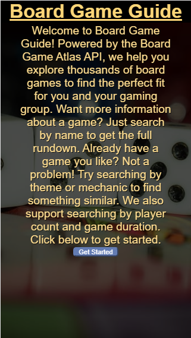
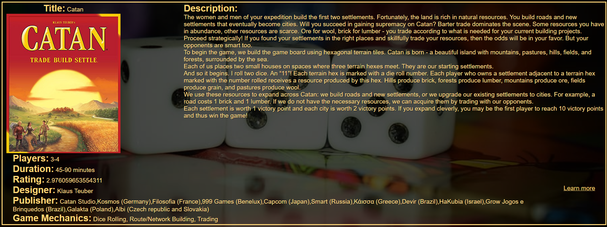
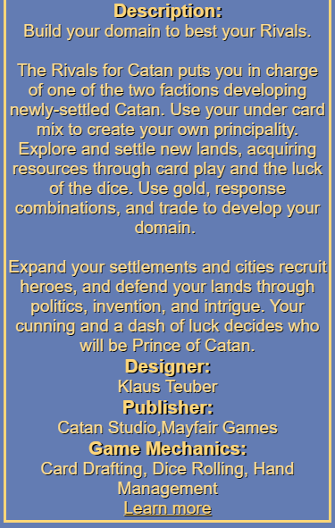
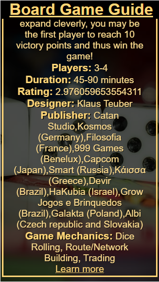

Board Game Guide
Repo: https://github.com/KevinPMoore/Board-Game-Guide

Live Page: https://kevinpmoore.github.io/Board-Game-Guide/

Summary:
Board Game Guide is a lightweight application to help people explore the vast world of board games.
Users are able to search for games by several criteria including name, designer and number of players.
Additionally, users more interested in browsing the vast library of games can receive recommendations
based on game mechanics such as dice-rolling or acting as well as themes like aliens or the wild west.

Screenshots:
* Landing Page
    * 
* Desktop Results
    * 
*Mobile Results
    * 
    * 

Built with:
All front-end code is built using Jquery along with vanilla Javascript and HTML
The back-end utilizes the Board Game Atlas API hosted at https://www.boardgameatlas.com/api/docs

Author:
Kevin Moore